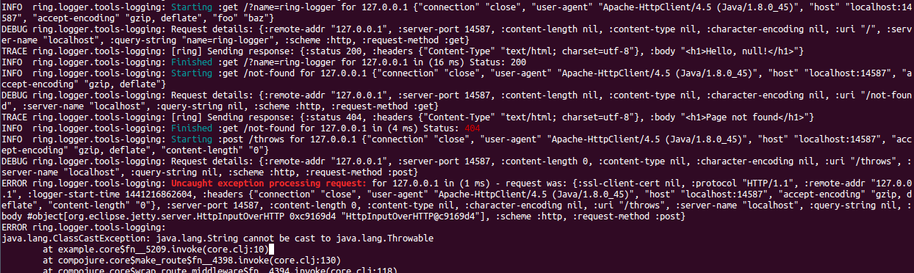

# Ring-logger [](https://circleci.com/gh/nberger/ring-logger)

Ring middleware to log duration and details for every request and response.

The logging backend is pluggable. Only the [clojure/tools.logging](https://github.com/clojure/tools.logging) implementation is included.

Additional known backends:

* [ring-logger-onelog](https://github.com/nberger/ring-logger-onelog)
* [ring-logger-timbre](https://github.com/nberger/ring-logger-timbre)

[](http://clojars.org/ring-logger)


## Usage

In your `project.clj`, add the following dependency:

```clojure
    [ring-logger "0.7.0"]
```


Then, just add the middleware to your stack. It comes preconfigured with
reasonable defaults, which append ANSI colorized log messages on each
request to whatever logger is in use by [clojure/tools.logging](https://github.com/clojure/tools.logging).

```clojure
    (ns foo
      (:require [ring.adapter.jetty     :as jetty]
                [ring.logger :as logger]))

    (defn my-ring-app [request]
         {:status 200
          :headers {"Content-Type" "text/html"}
          :body "Hello world!"})

    (jetty/run-jetty (logger/wrap-with-logger my-ring-app) {:port 8080})
```


### Usage with timbre

Check out [ring-logger-timbre](https://github.com/nberger/ring-logger-timbre)

### Migration from ring.middleware.logger (or if you just want to use some OneLog goodies)

Check out [ring-logger-onelog](https://github.com/nberger/ring-logger-onelog), or the
[0.6.x branch](https://github.com/nberger/ring-logger/tree/0.6.x)

## Custom Logger Backend

You can supply a custom logger backend by passing an instance that reifies
the ring.logger/Logger protocol as :logger.

Example:

```clojure
(wrap-with-logger my-ring-app
  {:logger (reify ring.logger/Logger
                  (log [level throwable msg]
                    (case level
                      :error
                      (println "OH NOES! We have an error!"
                               msg
                               (when throwable (.getMessage throwable)))

                      :trace
                      nil ; let's ignore trace messages

                      ; else
                      (println (name level) "-" msg)))})
```

Of course this can also be done with a deftype/defrecord,
see [ring-logger-onelog](https://github.com/nberger/ring-logger-onelog) and
[ring-logger-timbre](https://github.com/nberger/ring-logger-timbre) for examples.


## What Gets Logged

The default setup logs:

* an :info-level message when a request begins;
* an :info level message when a response is generated without any server
errors (i.e. its HTTP status is < 500);
* an :error level message when a response's HTTP status is >= 500;
* an :error level message with a stack trace when an exception is thrown during response generation.

All messages are timestamped.


## Custom messages and how to disable coloring

Instead of the default messages (for request start, details, exceptions, response trace) you might want to
provide your own custom messages. That's easy by supplying implementations of the printer multimethods
like `starting`, `request-details`, `exception` and others (see `ring.logger.messages` ns for more details)
and passing a `:printer` option to `wrap-with-logger`, like so:

```clojure
(defmethod request-details :my-printer
  [{:keys [logger] :as options} req]
  (trace logger (str "detailed request details: " req)
  (info logger (str "minimal request details: " (select-keys req [:character-encoding
                                                                  :content-length
                                                                  :request-method
                                                                  :uri]))))

(wrap-with-logger app {:printer :my-printer})
```

A `:no-color` printer is provided, so to disable color:

```clojure
(wrap-with-logger app {:printer :no-color})
```

## Example Log

This is an example of logging at TRACE level with log4j:



Check out [the example project](example) if you want to generate a similar output in your local machine.

## Log the request body (for debugging)

If logging the request & response metadata is not enough when debugging and you need to take a look to
each request body, then you can use `wrap-with-body-logger`:

```clojure
(def handler (-> app
                 wrap-with-logger
                 wrap-with-body-logger))
```

__Just be careful__: This is _inefficient_ as it has to consume the body input stream from the request
and then put it again as a new input stream so your handler can also consume it as would normally do.

## Logging only certain requests

If you wish to restrict logging to certain paths (or other
conditions), combine ring-logger with
[ring.middleware.conditional](https://github.com/pjlegato/ring.middleware.conditional), like so:

```clojure
(:require [ring.middleware.conditional :as c :refer  [if-url-starts-with
                                                      if-url-doesnt-start-with
                                                      if-url-matches
                                                      if-url-doesnt-match]])

(def my-ring-app
   (-> handler
       (if-url-starts-with "/foo" wrap-with-logger)

        ;; Or:
        ;; (c/if some-test-fn wrap-with-logger)
        ;; etc.

       wrap-with-other-handler))
```

Consult the [ring.middleware.conditional docs](https://github.com/pjlegato/ring.middleware.conditional) for full details.


## Roadmap

* 0.7.x
    - [x] Remove onelog if we think it doesn't needs to be in ring-logger (I mean: if the same can be done by using onelog in the client app + some customization).
    - [x] Leave only tools.logging implementation in ring-logger, extract timbre implementation to other library.
    - [ ] Add the unique request-id as log context in ring-logger. Currently it's only supported by ring-logger-onelog
    - [x] Use proper maps instead of keyword options.
    - [ ] Development: Add more tests.

* 0.6.x
    - [x] Keep the migration path from ring.middleware.logger as smooth as possible.
    - [x] Add support for tools.loggging and timbre, with the possibility to not bring not needed dependencies.
    - [x] Allow for more customizations (color/no-color, customize specific log messages).
    - [x] Development: Add tests, use continuous integration.

## Similar projects

[pjlegato/ring.middleware.logger](http://github.com/pjlegato/ring.middleware.logger): ring-logger started as a fork
of ring.middleware.logger. We recommend it as a great option if you don't mind pulling a transitive dependency on onelog & log4j.

## Contributing

Pull requests are welcome!

## License

Copyright (C) 2015 Nicolás Berger, 2012-2014 Paul Legato.

Distributed under the Eclipse Public License, the same as Clojure.
